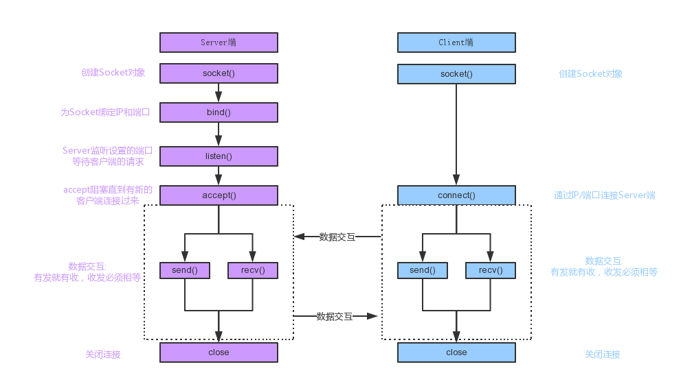

在Python中，import socket后，用socket.socket()方法来创建套接字，语法格式如下：

sk = socket.socket([family[, type[, proto]]])

参数说明：

1.family: 套接字家族，可以使AF_UNIX或者AF_INET。

2.type: 套接字类型，根据是面向连接的还是非连接分为SOCK_STREAM或SOCK_DGRAM，也就是TCP和UDP的区别。

3.protocol: 一般不填默认为0。

|  socket类型   | 描述  |
|  ----  | ----  |
| socket.AF_UNIX  | 只能够用于单一的Unix系统进程间通信 |
| socket.AF_INET6 | IPv6 |
|socket.SOCK_STREAM	|流式socket , for TCP|
|socket.SOCK_DGRAM  |数据报式socket , for UDP|
|socket.SOCK_RAW	|原始套接字，普通的套接字无法处理ICMP、IGMP等网络报文，而SOCK_RAW可以； 其次，SOCK_RAW也可以处理特殊的IPv4报文； 此外，利用原始套接字，可以通过IP_HDRINCL套接字选项由用户构造IP头。|
|socket.SOCK_SEQPACKET	|可靠的连续数据包服务|
|创建TCP Socket：	|s=socket.socket(socket.AF_INET,socket.SOCK_STREAM)|
|创建UDP Socket：	|s=socket.socket(socket.AF_INET,socket.SOCK_DGRAM)|

